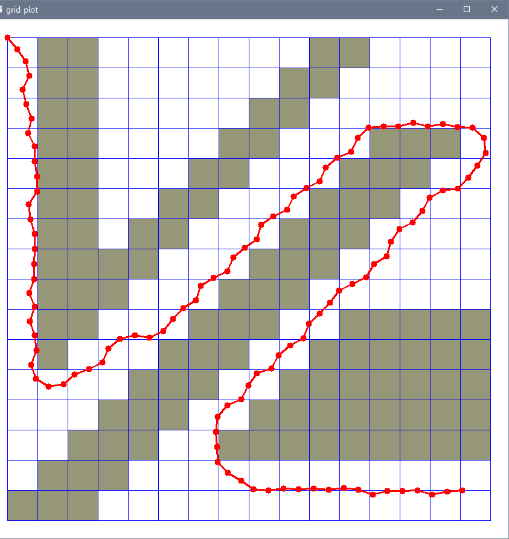

# Week 7 - Hybrid A* Algorithm & Trajectory Generation

---

[//]: # (Image References)
[has-example]: ./hybrid_a_star/has_example.png
[ptg-example]: ./PTG/ptg_example.png

## Assignment: Hybrid A* Algorithm

In directory [`./hybrid_a_star`](./hybrid_a_star), a simple test program for the hybrid A* algorithm is provided. Run the following command to test:

```
$ python main.py
```

The program consists of three modules:

* `main.py` defines the map, start configuration and end configuration. It instantiates a `HybridAStar` object and calls the search method to generate a motion plan.
* `hybrid_astar.py` implements the algorithm.
* `plot.py` provides an OpenCV-based visualization for the purpose of result monitoring.

You have to implement the following sections of code for the assignment:

* Trajectory generation: in the method `HybridAStar.expand()`, a simple one-point trajectory shall be generated based on a basic bicycle model. This is going to be used in expanding 3-D grid cells in the algorithm's search operation.
* Hybrid A* search algorithm: in the method `HybridAStar.search()`, after expanding the states reachable from the current configuration, the algorithm must process each state (i.e., determine the grid cell, check its validity, close the visited cell, and record the path. You will have to write code in the `for n in next_states:` loop.
* Discretization of heading: in the method `HybridAStar.theta_to_stack_num()`, you will write code to map the vehicle's orientation (theta) to a finite set of stack indices.
* Heuristic function: in the method `HybridAStar.heuristic()`, you define a heuristic function that will be used in determining the priority of grid cells to be expanded. For instance, the distance to the goal is a reasonable estimate of each cell's cost.

You are invited to tweak various parameters including the number of stacks (heading discretization granularity) and the vehicle's velocity. It will also be interesting to adjust the grid granularity of the map. The following figure illustrates an example output of the program with the default map given in `main.py` and `NUM_THETA_CELLS = 360` while the vehicle speed is set to 0.5.

![Example Output of the Hybrid A* Test Program][has-example]

---

## Experiment: Polynomial Trajectory Generation

In directory [`./PTG`](./PTG), a sample program is provided that tests polynomial trajectory generation. If you input the following command:

```
$ python evaluate_ptg.py
```

you will see an output such as the following figure.

![Example Output of the Polynomial Trajectory Generator][ptg-example]

Note that the above figure is an example, while the result you get will be different from run to run because of the program's random nature. The program generates a number of perturbed goal configurations, computes a jerk minimizing trajectory for each goal position, and then selects the one with the minimum cost as defined by the cost functions and their combination.

Your job in this experiment is:

1. to understand the polynomial trajectory generation by reading the code already implemented and in place; given a start configuration and a goal configuration, the algorithm computes coefficient values for a quintic polynomial that defines the jerk minimizing trajectory; and
2. to derive an appropriate set of weights applied to the cost functions; the mechanism to calculate the cost for a trajectory and selecting one with the minimum cost is the same as described in the previous (Week 6) lecture.

Experiment by tweaking the relative weight for each cost function. It will also be very interesting to define your own cost metric and implement it using the information associated with trajectories.

## Report
### Hybrid A* Algorithm
- Hybrid A* 알고리즘은 기존의 A* 알고리즘에서 차량의 motion을 고려하여 셀 내에서의 차량의 position을 결정함으로써 drivable path를 생성하는 extended 알고리즘이다.
- 따라서 Hybrid A* 알고리즘을 사용하면 drivable path를 찾을 수 있지만, optimality나 completeness를 항상 보장하지는 못한다.
- Hybrid A* 알고리즘을 구현하기 위해 작성한 코드는 아래와 같다.
    ``` python
    def expand(self, current, goal):
        g = current['g']
        x, y, theta = current['x'], current['y'], current['t']

        g2 = g + 1
        next_states = []

        # 아래에서 delta_t는 차량의 조향각을 의미한다.
        # 조향각의 경우 -35도부터 35도까지 5도 간격으로 discrete한 값을 가지도록 설정하였다.
        # 각각의 조향각으로 조향할 때 차량의 이동할 위치를 motion 모델로부터 구한다.
        for delta_t in range(self.omega_min, self.omega_max + self.omega_step, self.omega_step):
            # 차량의 motion 모델로부터 차량의 현재 속도와 조향각 delta_t를 이용하여 차량의 다음 state (next_x, next_y, theta2)를 구한다.
            delta_t *= (np.pi / 180)
            omega = self.speed / self.length * np.tan(delta_t)
            # 아래에서 구현한 normalize 메서드를 통해 각도를 0 ~ 2 * pi 범위 내로 normalize한다.
            theta2 = self.normalize(theta + omega)
            next_x = x + self.speed * np.cos(theta2)
            next_y = y + self.speed * np.sin(theta2)

            # 위에서 구한 다음 state 중에서 그리드 맵 내에 존재하는(이동 가능한) state만 next_states에 입력하도록 하였다.
            if 0 <= self.idx(next_x) < self.dim[1] and 0 <= self.idx(next_y) < self.dim[2]:
                # 출발지로부터의 거리에 대한 cost g2와 도착지까지의 heuristic cost를 합하여 total cost next_f를 계산한다.
                next_f = g2 + self.heuristic(next_x, next_y, goal)
                # next state로 (next_x, next_y, theta2, g2, next_f)를 담아 next_states에 append하고 현재 state에서 expand 가능한 next_states를 모두 구하면 이를 리턴한다.
                expanded_state = self.State(next_x, next_y, theta2, g2, next_f)
                next_states.append(expanded_state)
        return next_states

    def normalize(self, theta):
        while theta >= 2 * np.pi:
            theta -= 2 * np.pi
        while theta < 0:
            theta += 2 * np.pi
        if theta == 2 * np.pi:
            theta -= 2 * np.pi
        return theta

    def State(self, x, y, theta, g, f):
        state = {
                    'f': f,
                    'g': g,
                    'x': x,
                    'y': y,
                    't': theta,
                }
        return state
    ```
- 아래는 도착지에 대한 heuristic cost를 계산하기 위해 구현한 메서드이다.
- 한 state에서 도착지까지의 거리를 Euclidean distance와 Manhatten distance를 모두 사용하여 경로를 생성해보았다.
- 그 결과 Euclidean distance보다 Manhatten distance가 조금 더 smooth한 경로를 생성하는 것 같아 Manhatten distance를 heuristic cost에 사용하였다.
    ``` python
    def heuristic(self, x, y, goal):
        # euclidean_distance = np.sqrt((x - goal[0]) ** 2 + (y - goal[1]) ** 2)
        manhattan_distance = abs(x - goal[0]) + abs(y - goal[1])
        return manhattan_distance
    ```
- 마지막으로 A* 알고리즘을 통해 경로를 탐색하는 search() 매서드를 아래와 같이 구현하였다.
- search() 메서드 중에서도 실제 경로를 탐색하는 반복문만 아래에 나타내었다.
- 먼저 
- 
    ``` python
    while len(opened) > 0:
        opened.sort(key=lambda s : s['f'], reverse=True)
        #opened list로부터 Total cost f가 가장 작은 state curr을 pop한다.
        curr = opened.pop()
        x, y = curr['x'], curr['y']
        # pop한 state가 도착지인지 확인하여 도착지인 경우 해당 state를 final에 입력하고 found를 True로 변경한 후 반복문을 종료한다.
        if (self.idx(x), self.idx(y)) == goal:
            self.final = curr
            found = True
            break
        
        # curr이 도착지가 아닌 경우 계속해서 경로 탐색을 진행하기 위해 curr로부터 expand 가능한 next state를 탐색한다.
        next_states = self.expand(curr, goal)
        # 아래의 for문은 expand 가능한 next state가 opened list에 추가할 노드인지를 판단하는 코드이다.        
        for n in next_states:
            idx_x, idx_y = self.idx(n['x']), self.idx(n['y'])
            stack = self.theta_to_stack_num(n['t'])
            #  먼저 next state가 속한 그리드 셀이 장애물이 아닌지를 판단한다.
            if grid[idx_x, idx_y] == 0:
                # 해당 셀이 장애물이 아닌 경우,
                # curr에서부터 next state까지 이동하는 경로에 장애물이 있지는 않은지를 판단한다.
                # 아래의 코드에서는 curr와 next state 사이의 셀 중에서 한 군데라도 장애물이 있는 경우 이동이 불가한 state라고 판단하였다.
                # 예를 들어 curr이 (0, 0)이고 next state가 (2, 1)일 때 (1, 0), (2, 0), (0, 1), (1, 1)에 해당하는 셀 중에서 하나라도 장애물이 있는 경우 해당 next state를 opened list에 입력하지 않는다. 
                dist_x, dist_y = abs(self.idx(x) - idx_x), abs(self.idx(y) - idx_y)
                min_x, min_y = np.minimum(self.idx(x), idx_x), np.minimum(self.idx(y), idx_y)
                possible = True
                for d_x in range(dist_x + 1):
                    for d_y in range(dist_y + 1):
                        if grid[min_x + d_x, min_y + d_y] != 0:
                            possible = False
                # 위의 과정을 통과하였을 때 possible이 True인 경우 해당 next state가 이미 방문한 state는 아닌지 closed list를 통해 확인한다.
                if possible and self.closed[stack][idx_x][idx_y] == 0:
                    # closed list에도 속하지 않은 state의 경우에만 최종적으로 opened list에 입력하게 된다.
                    # 또한 closed list에도 해당 state가 방문 완료된 것으로 변경하고, curr state를 parent state로 입력한다.
                    self.closed[stack][idx_x][idx_y] = 1
                    total_closed += 1
                    self.came_from[stack][idx_x][idx_y] = curr
                    opened.append(n)

    else:
        found = False

    return found, total_closed

    # theta_to_stack_num() 메서드는 theta 값을 입력했을 때 해당 theta 값이 속해야 할 dimension을 리턴해준다. 
    def theta_to_stack_num(self, theta):
        interval = 2 * np.pi / self.dim[0]
        stack_num = 0
        while theta > interval:
            theta -= interval
            stack_num += 1
        if stack_num == self.NUM_THETA_CELLS:
            stack_num = 0
        return int(stack_num)
    ```

#### Result
- 아래의 결과는 강의자료의 예시에서 사용한 Speed와 NUM_THETA_CELLS 값을 대입하여 구현한 Hybrid A* 알고리즘을 실행한 결과이다.
  > Speed = 0.5, NUM_THETA_CELLS = 90  
  >    
  >  `Found path to goal in 6190 expansions`
      
  > Speed = 1.0, NUM_THETA_CELLS = 90  
  >    
  >  `Found path to goal in 5970 expansions`

  > Speed = 0.5, NUM_THETA_CELLS = 180  
  >    
  >  `Found path to goal in 12954 expansions`

  > Speed = 1.0, NUM_THETA_CELLS = 180  
  >    
  >  `Found path to goal in 11893 expansions`

  > Speed = 0.5, NUM_THETA_CELLS = 360  
  >    
  >  `Found path to goal in 25493 expansions`

  > Speed = 1.0, NUM_THETA_CELLS = 360  
  >    
  >  `Found path to goal in 23407 expansions`
- 결과를 보면, 모든 조건에 대해 경로가 장애물을 피해 도착지에 도달하는 것을 알 수 있다.
- 뿐만 아니라 아래의 결과와 같이 Speed = 1.5일 때에도 경로를 잘 찾는 것을 확인할 수 있었다.
  > Speed = 1.5, NUM_THETA_CELLS = 360  
  >    
  >  `Found path to goal in 15629 expansions`
- Speed = 2.0일 때에는 경로를 탐색하지 못하는 것을 알 수 있는데 이는 그리드 맵 상에서 이동할 수 있는 물리적인 한계가 있기 때문인 것으로 보인다.
  > Speed = 2.0, NUM_THETA_CELLS = 360  
  > `No valid path found after 11255 expansions`